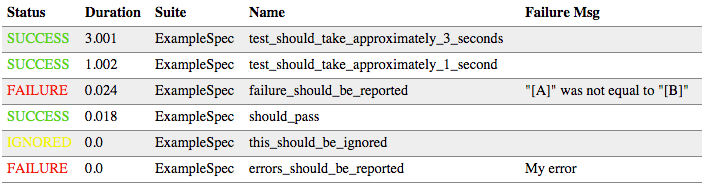

What it Does
============

The Tabular Test Reporter plugin provides a test listener, `TabularTestReporter`, that writes test results in a whitespace-separated tabular format to a file. This makes it easy to analyse test results using standard unix tools, such as
sort, awk and uniq.

Here is an example result for an [example test suite](https://github.com/programmiersportgruppe/sbt-tabular-test-reporter/blob/master/src/sbt-test/simple-example/src/test/scala/ExampleSpec.scala):

    2015-03-01T10:00:30 SUCCESS    0.183    0.013 ExampleSpec should_pass
    2015-03-01T10:00:30 FAILURE    0.191    0.023 ExampleSpec failure_should_be_reported "[A]" was not equal to "[B]"
    2015-03-01T10:00:30 FAILURE    0.166    0.000 ExampleSpec errors_should_be_reported My error
    2015-03-01T10:00:30 SUCCESS    2.166    2.001 ExampleSpec test_should_take_approximately_2_seconds
    2015-03-01T10:00:30 SUCCESS    0.666    0.502 ExampleSpec test_should_take_approximately_0.5_seconds
    2015-03-01T10:00:30 IGNORED    0.000    0.000 ExampleSpec this_should_be_ignored

Get Started
===========

Add the following lines to either ~/.sbt/plugins/build.sbt (user-specific) or project/plugins/build.sbt (project-specific):

    addSbtPlugin("org.programmiersportgruppe.sbt" %% "tabulartestreporter" % "2.0.0")

This will add the plugin dependency to your project.
Tabular Test Reporter is an auto plugin, and automatically registers a `TabularTestReporter` as a test listener, so no additional configuration is required.

Analysing Results
=================

All the test results for a project are written into a single file that has a timestamped filename
such as `target/test-reports/test-results-20150207-130331.txt`. There is also a convenient symlink to the latest
test result: `target/test-results-latest.txt`.

Format
------

The table has the following columns:

1. A timestamp that conforms to this strftime format `%Y-%m-%dT%H:%M:%S`
2. The outcome (SUCCESS, FAILURE, IGNORED, ERROR)
3. The duration of the test case including the setup time distributed equally across all tests in a suite
4. The duration of the test case without setup time
5. The name of the test suite
6. The name of the test case
7. Optionally the failure message

Examples
--------

To find the three test cases that take the most time can be found trivially using the `sort` utility:

~~~
cat target/test-results-latest.txt \
    | sort --numeric --reverse --key=3 \
    | head -n 3
~~~

Issues across build runs can be analysed using `find`. The following example returns results for a single
test case across build runs:

~~~
find target/test-reports/ -name "*.txt" \
    | xargs cat \
    | grep "AnotherSpec this_should_take_more_time"
~~~

This can be very helpful in analysing failure patterns or performance degradation.

More Features
=============

In addition to the text report, an html file is also generated containing a table that supports sorting by a colunm when its header is clicked.
Here is an example table sorted by test duration:

Open
====

Features
--------

* Make automatic testing with scripted work.
* Make output format configurable, e.g. tab-separated.

Questions
---------

* Should the hostname be included in the file?
* Should the current commit and a flag indicating whether the working copy is clean be included?
* Is timestamping the filename the right solution or should we have an "archiving plugin"
  that copies files after a successful run into the archive folder?

