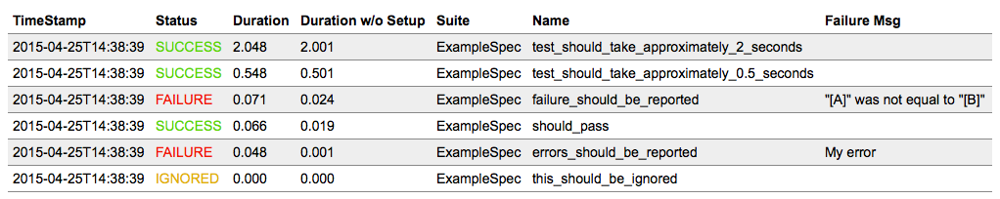

What it Does
============

The Tabular Test Reporter plugin provides a test listener, `TabularTestReporter`, that writes test results in
tabular formats, such as whitespace-separated values, to a file. This makes it easy to analyse test results using
standard unix tools, such as sort, awk and uniq.

Here is an example result for an [example test suite](https://github.com/programmiersportgruppe/sbt-tabular-test-reporter/blob/master/src/sbt-test/simple-example/src/test/scala/ExampleSpec.scala):

    2015-03-01T10:00:30 SUCCESS    0.183    0.013 ExampleSpec should_pass
    2015-03-01T10:00:30 FAILURE    0.191    0.023 ExampleSpec failure_should_be_reported "[A]" was not equal to "[B]"
    2015-03-01T10:00:30 FAILURE    0.166    0.000 ExampleSpec errors_should_be_reported My error
    2015-03-01T10:00:30 SUCCESS    2.166    2.001 ExampleSpec test_should_take_approximately_2_seconds
    2015-03-01T10:00:30 SUCCESS    0.666    0.502 ExampleSpec test_should_take_approximately_0.5_seconds
    2015-03-01T10:00:30 IGNORED    0.000    0.000 ExampleSpec this_should_be_ignored

Get Started
===========

Add the following lines to either ~/.sbt/plugins/build.sbt (user-specific) or project/plugins/build.sbt (project-specific):

    addSbtPlugin("org.programmiersportgruppe.sbt" %% "tabulartestreporter" % "3.0.0")

This will add the plugin dependency to your project.
Tabular Test Reporter is an auto plugin, and automatically registers a `TabularTestReporter` as a test listener, so no additional configuration is required.

The output formats can be configured using the `testReportFormats`` setting. Here is an example to
produce files in all formats:

    testReportFormats := Set(WhiteSpaceDelimited, Html, Json)

Analysing Results
=================

All the test results for a project are written into a single file that has a timestamped filename
such as `target/test-reports/test-results-20150207-130331.txt`. There is also a convenient symlink to the latest
test result: `target/test-results-latest.txt`.

Format
------

The table has the following columns:

1. A timestamp that conforms to this strftime format `%Y-%m-%dT%H:%M:%S`
2. The outcome (SUCCESS, FAILURE, IGNORED, ERROR)
3. The duration of the test case including the setup time distributed equally across all tests in a suite
4. The duration of the test case without setup time
5. The name of the test suite
6. The name of the test case
7. Optionally the failure message

Examples
--------

To find the three test cases that take the most time can be found trivially using the `sort` utility:

~~~
cat target/test-results-latest.txt \
    | sort --numeric --reverse --key=3 \
    | head -n 3
~~~

Issues across build runs can be analysed using `find`. The following example returns results for a single
test case across build runs:

~~~
find target/test-reports/ -name "*.txt" \
    | xargs cat \
    | grep "AnotherSpec this_should_take_more_time"
~~~

This can be very helpful in analysing failure patterns or performance degradation.

More Features
=============

Html Report
-----------

In addition to the text report, an html file is also generated containing a table that supports sorting by a colunm when its header is clicked.
Here is an example table sorted by test duration:

Json Report
-----------

For more advanced trouble shooting the single nature of the white space separated file
is not providing enough information, such as the stacktrace for failed tests.
For this purpose there is the a JSON-format which looks like this:

    {"timestamp":"2015-12-13T15:47:24","status":"SUCCESS","durationWithSetup":0.05,"duration":0.016,"suite":"ExampleSpec","test":"should pass","test-timestamp":"2015-12-13T15:47:27","errorMessage":"","stackTrace":""}
    {"timestamp":"2015-12-13T15:47:24","status":"FAILURE","durationWithSetup":0.053,"duration":0.019,"suite":"ExampleSpec","test":"failure should be reported","test-timestamp":"2015-12-13T15:47:27","errorMessage":"\"[A]\" was not equal to \"[B]\"","stackTrace":"org.scalatest.exceptions.TestFailedException: \"[A]\" was not equal to \"[B]\"\n\tat org.scalatest.MatchersHelper$.newTestFailedException(MatchersHelper.scala:160)\n\tat org.scalatest.Matchers$ShouldMethodHelper$.shouldMatcher(Matchers.scala:6231)\n\tat org.scalatest.Matchers$AnyShouldWrapper.should(Matchers.scala:6265)\n\tat ExampleSpec$$anonfun$2.apply$mcV$sp(ExampleSpec.scala:11)\n\tat ExampleSpec$$anonfun$2.apply(ExampleSpec.scala:11)\n\tat ExampleSpec$$anonfun$2.apply(ExampleSpec.scala:11)\n\tat org.scalatest.Transformer$$anonfun$apply$1.apply$mcV$sp(Transformer.scala:22)\n\tat org.scalatest.OutcomeOf$class.outcomeOf(OutcomeOf.scala:85)\n\tat org.scalatest.OutcomeOf$.outcomeOf(OutcomeOf.scala:104)\n\tat org.scalatest.Transformer.apply(Transformer.scala:22)\n\tat org.scalatest.Transformer.apply(Transformer.scala:20)\n\tat org.scalatest.FunSuiteLike$$anon$1.apply(FunSuiteLike.scala:166)\n\tat org.scalatest.Suite$class.withFixture(Suite.scala:1122)\n\tat org.scalatest.FunSuite.withFixture(FunSuite.scala:1555)\n\tat org.scalatest.FunSuiteLike$class.invokeWithFixture$1(FunSuiteLike.scala:163)\n\tat org.scalatest.FunSuiteLike$$anonfun$runTest$1.apply(FunSuiteLike.scala:175)\n\tat org.scalatest.FunSuiteLike$$anonfun$runTest$1.apply(FunSuiteLike.scala:175)\n\tat org.scalatest.SuperEngine.runTestImpl(Engine.scala:306)\n\tat org.scalatest.FunSuiteLike$class.runTest(FunSuiteLike.scala:175)\n\tat org.scalatest.FunSuite.runTest(FunSuite.scala:1555)\n\tat org.scalatest.FunSuiteLike$$anonfun$runTests$1.apply(FunSuiteLike.scala:208)\n\tat org.scalatest.FunSuiteLike$$anonfun$runTests$1.apply(FunSuiteLike.scala:208)\n\tat org.scalatest.SuperEngine$$anonfun$traverseSubNodes$1$1.apply(Engine.scala:413)\n\tat org.scalatest.SuperEngine$$anonfun$traverseSubNodes$1$1.apply(Engine.scala:401)\n\tat scala.collection.immutable.List.foreach(List.scala:381)\n\tat org.scalatest.SuperEngine.traverseSubNodes$1(Engine.scala:401)\n\tat org.scalatest.SuperEngine.org$scalatest$SuperEngine$$runTestsInBranch(Engine.scala:396)\n\tat org.scalatest.SuperEngine.runTestsImpl(Engine.scala:483)\n\tat org.scalatest.FunSuiteLike$class.runTests(FunSuiteLike.scala:208)\n\tat org.scalatest.FunSuite.runTests(FunSuite.scala:1555)\n\tat org.scalatest.Suite$class.run(Suite.scala:1424)\n\tat org.scalatest.FunSuite.org$scalatest$FunSuiteLike$$super$run(FunSuite.scala:1555)\n\tat org.scalatest.FunSuiteLike$$anonfun$run$1.apply(FunSuiteLike.scala:212)\n\tat org.scalatest.FunSuiteLike$$anonfun$run$1.apply(FunSuiteLike.scala:212)\n\tat org.scalatest.SuperEngine.runImpl(Engine.scala:545)\n\tat org.scalatest.FunSuiteLike$class.run(FunSuiteLike.scala:212)\n\tat org.scalatest.FunSuite.run(FunSuite.scala:1555)\n\tat org.scalatest.tools.Framework.org$scalatest$tools$Framework$$runSuite(Framework.scala:466)\n\tat org.scalatest.tools.Framework$ScalaTestTask.execute(Framework.scala:677)\n\tat sbt.TestRunner.runTest$1(TestFramework.scala:76)\n\tat sbt.TestRunner.run(TestFramework.scala:85)\n\tat sbt.TestFramework$$anon$2$$anonfun$$init$$1$$anonfun$apply$8.apply(TestFramework.scala:202)\n\tat sbt.TestFramework$$anon$2$$anonfun$$init$$1$$anonfun$apply$8.apply(TestFramework.scala:202)\n\tat sbt.TestFramework$.sbt$TestFramework$$withContextLoader(TestFramework.scala:185)\n\tat sbt.TestFramework$$anon$2$$anonfun$$init$$1.apply(TestFramework.scala:202)\n\tat sbt.TestFramework$$anon$2$$anonfun$$init$$1.apply(TestFramework.scala:202)\n\tat sbt.TestFunction.apply(TestFramework.scala:207)\n\tat sbt.Tests$$anonfun$9.apply(Tests.scala:216)\n\tat sbt.Tests$$anonfun$9.apply(Tests.scala:216)\n\tat sbt.std.Transform$$anon$3$$anonfun$apply$2.apply(System.scala:44)\n\tat sbt.std.Transform$$anon$3$$anonfun$apply$2.apply(System.scala:44)\n\tat sbt.std.Transform$$anon$4.work(System.scala:63)\n\tat sbt.Execute$$anonfun$submit$1$$anonfun$apply$1.apply(Execute.scala:226)\n\tat sbt.Execute$$anonfun$submit$1$$anonfun$apply$1.apply(Execute.scala:226)\n\tat sbt.ErrorHandling$.wideConvert(ErrorHandling.scala:17)\n\tat sbt.Execute.work(Execute.scala:235)\n\tat sbt.Execute$$anonfun$submit$1.apply(Execute.scala:226)\n\tat sbt.Execute$$anonfun$submit$1.apply(Execute.scala:226)\n\tat sbt.ConcurrentRestrictions$$anon$4$$anonfun$1.apply(ConcurrentRestrictions.scala:159)\n\tat sbt.CompletionService$$anon$2.call(CompletionService.scala:28)\n\tat java.util.concurrent.FutureTask.run(FutureTask.java:266)\n\tat java.util.concurrent.Executors$RunnableAdapter.call(Executors.java:511)\n\tat java.util.concurrent.FutureTask.run(FutureTask.java:266)\n\tat java.util.concurrent.ThreadPoolExecutor.runWorker(ThreadPoolExecutor.java:1142)\n\tat java.util.concurrent.ThreadPoolExecutor$Worker.run(ThreadPoolExecutor.java:617)\n\tat java.lang.Thread.run(Thread.java:745)\n"}
    {"timestamp":"2015-12-13T15:47:24","status":"FAILURE","durationWithSetup":0.035,"duration":0.001,"suite":"ExampleSpec","test":"failure with fancy characters","test-timestamp":"2015-12-13T15:47:27","errorMessage":"\"[ç]\" was not equal to \"[Ä]\"","stackTrace":"org.scalatest.exceptions.TestFailedException: \"[ç]\" was not equal to \"[Ä]\"\n\tat org.scalatest.MatchersHelper$.newTestFailedException(MatchersHelper.scala:160)\n\tat org.scalatest.Matchers$ShouldMethodHelper$.shouldMatcher(Matchers.scala:6231)\n\tat org.scalatest.Matchers$AnyShouldWrapper.should(Matchers.scala:6265)\n\tat ExampleSpec$$anonfun$3.apply$mcV$sp(ExampleSpec.scala:15)\n\tat ExampleSpec$$anonfun$3.apply(ExampleSpec.scala:15)\n\tat ExampleSpec$$anonfun$3.apply(ExampleSpec.scala:15)\n\tat org.scalatest.Transformer$$anonfun$apply$1.apply$mcV$sp(Transformer.scala:22)\n\tat org.scalatest.OutcomeOf$class.outcomeOf(OutcomeOf.scala:85)\n\tat org.scalatest.OutcomeOf$.outcomeOf(OutcomeOf.scala:104)\n\tat org.scalatest.Transformer.apply(Transformer.scala:22)\n\tat org.scalatest.Transformer.apply(Transformer.scala:20)\n\tat org.scalatest.FunSuiteLike$$anon$1.apply(FunSuiteLike.scala:166)\n\tat org.scalatest.Suite$class.withFixture(Suite.scala:1122)\n\tat org.scalatest.FunSuite.withFixture(FunSuite.scala:1555)\n\tat org.scalatest.FunSuiteLike$class.invokeWithFixture$1(FunSuiteLike.scala:163)\n\tat org.scalatest.FunSuiteLike$$anonfun$runTest$1.apply(FunSuiteLike.scala:175)\n\tat org.scalatest.FunSuiteLike$$anonfun$runTest$1.apply(FunSuiteLike.scala:175)\n\tat org.scalatest.SuperEngine.runTestImpl(Engine.scala:306)\n\tat org.scalatest.FunSuiteLike$class.runTest(FunSuiteLike.scala:175)\n\tat org.scalatest.FunSuite.runTest(FunSuite.scala:1555)\n\tat org.scalatest.FunSuiteLike$$anonfun$runTests$1.apply(FunSuiteLike.scala:208)\n\tat org.scalatest.FunSuiteLike$$anonfun$runTests$1.apply(FunSuiteLike.scala:208)\n\tat org.scalatest.SuperEngine$$anonfun$traverseSubNodes$1$1.apply(Engine.scala:413)\n\tat org.scalatest.SuperEngine$$anonfun$traverseSubNodes$1$1.apply(Engine.scala:401)\n\tat scala.collection.immutable.List.foreach(List.scala:381)\n\tat org.scalatest.SuperEngine.traverseSubNodes$1(Engine.scala:401)\n\tat org.scalatest.SuperEngine.org$scalatest$SuperEngine$$runTestsInBranch(Engine.scala:396)\n\tat org.scalatest.SuperEngine.runTestsImpl(Engine.scala:483)\n\tat org.scalatest.FunSuiteLike$class.runTests(FunSuiteLike.scala:208)\n\tat org.scalatest.FunSuite.runTests(FunSuite.scala:1555)\n\tat org.scalatest.Suite$class.run(Suite.scala:1424)\n\tat org.scalatest.FunSuite.org$scalatest$FunSuiteLike$$super$run(FunSuite.scala:1555)\n\tat org.scalatest.FunSuiteLike$$anonfun$run$1.apply(FunSuiteLike.scala:212)\n\tat org.scalatest.FunSuiteLike$$anonfun$run$1.apply(FunSuiteLike.scala:212)\n\tat org.scalatest.SuperEngine.runImpl(Engine.scala:545)\n\tat org.scalatest.FunSuiteLike$class.run(FunSuiteLike.scala:212)\n\tat org.scalatest.FunSuite.run(FunSuite.scala:1555)\n\tat org.scalatest.tools.Framework.org$scalatest$tools$Framework$$runSuite(Framework.scala:466)\n\tat org.scalatest.tools.Framework$ScalaTestTask.execute(Framework.scala:677)\n\tat sbt.TestRunner.runTest$1(TestFramework.scala:76)\n\tat sbt.TestRunner.run(TestFramework.scala:85)\n\tat sbt.TestFramework$$anon$2$$anonfun$$init$$1$$anonfun$apply$8.apply(TestFramework.scala:202)\n\tat sbt.TestFramework$$anon$2$$anonfun$$init$$1$$anonfun$apply$8.apply(TestFramework.scala:202)\n\tat sbt.TestFramework$.sbt$TestFramework$$withContextLoader(TestFramework.scala:185)\n\tat sbt.TestFramework$$anon$2$$anonfun$$init$$1.apply(TestFramework.scala:202)\n\tat sbt.TestFramework$$anon$2$$anonfun$$init$$1.apply(TestFramework.scala:202)\n\tat sbt.TestFunction.apply(TestFramework.scala:207)\n\tat sbt.Tests$$anonfun$9.apply(Tests.scala:216)\n\tat sbt.Tests$$anonfun$9.apply(Tests.scala:216)\n\tat sbt.std.Transform$$anon$3$$anonfun$apply$2.apply(System.scala:44)\n\tat sbt.std.Transform$$anon$3$$anonfun$apply$2.apply(System.scala:44)\n\tat sbt.std.Transform$$anon$4.work(System.scala:63)\n\tat sbt.Execute$$anonfun$submit$1$$anonfun$apply$1.apply(Execute.scala:226)\n\tat sbt.Execute$$anonfun$submit$1$$anonfun$apply$1.apply(Execute.scala:226)\n\tat sbt.ErrorHandling$.wideConvert(ErrorHandling.scala:17)\n\tat sbt.Execute.work(Execute.scala:235)\n\tat sbt.Execute$$anonfun$submit$1.apply(Execute.scala:226)\n\tat sbt.Execute$$anonfun$submit$1.apply(Execute.scala:226)\n\tat sbt.ConcurrentRestrictions$$anon$4$$anonfun$1.apply(ConcurrentRestrictions.scala:159)\n\tat sbt.CompletionService$$anon$2.call(CompletionService.scala:28)\n\tat java.util.concurrent.FutureTask.run(FutureTask.java:266)\n\tat java.util.concurrent.Executors$RunnableAdapter.call(Executors.java:511)\n\tat java.util.concurrent.FutureTask.run(FutureTask.java:266)\n\tat java.util.concurrent.ThreadPoolExecutor.runWorker(ThreadPoolExecutor.java:1142)\n\tat java.util.concurrent.ThreadPoolExecutor$Worker.run(ThreadPoolExecutor.java:617)\n\tat java.lang.Thread.run(Thread.java:745)\n"}
    {"timestamp":"2015-12-13T15:47:24","status":"FAILURE","durationWithSetup":0.034,"duration":0.0,"suite":"ExampleSpec","test":"errors should be reported","test-timestamp":"2015-12-13T15:47:27","errorMessage":"My error","stackTrace":"java.lang.RuntimeException: My error\nWith a second line.   \n\tat ExampleSpec$$anonfun$7.apply(ExampleSpec.scala:19)\n\tat ExampleSpec$$anonfun$7.apply(ExampleSpec.scala:19)\n\tat org.scalatest.Transformer$$anonfun$apply$1.apply$mcV$sp(Transformer.scala:22)\n\tat org.scalatest.OutcomeOf$class.outcomeOf(OutcomeOf.scala:85)\n\tat org.scalatest.OutcomeOf$.outcomeOf(OutcomeOf.scala:104)\n\tat org.scalatest.Transformer.apply(Transformer.scala:22)\n\tat org.scalatest.Transformer.apply(Transformer.scala:20)\n\tat org.scalatest.FunSuiteLike$$anon$1.apply(FunSuiteLike.scala:166)\n\tat org.scalatest.Suite$class.withFixture(Suite.scala:1122)\n\tat org.scalatest.FunSuite.withFixture(FunSuite.scala:1555)\n\tat org.scalatest.FunSuiteLike$class.invokeWithFixture$1(FunSuiteLike.scala:163)\n\tat org.scalatest.FunSuiteLike$$anonfun$runTest$1.apply(FunSuiteLike.scala:175)\n\tat org.scalatest.FunSuiteLike$$anonfun$runTest$1.apply(FunSuiteLike.scala:175)\n\tat org.scalatest.SuperEngine.runTestImpl(Engine.scala:306)\n\tat org.scalatest.FunSuiteLike$class.runTest(FunSuiteLike.scala:175)\n\tat org.scalatest.FunSuite.runTest(FunSuite.scala:1555)\n\tat org.scalatest.FunSuiteLike$$anonfun$runTests$1.apply(FunSuiteLike.scala:208)\n\tat org.scalatest.FunSuiteLike$$anonfun$runTests$1.apply(FunSuiteLike.scala:208)\n\tat org.scalatest.SuperEngine$$anonfun$traverseSubNodes$1$1.apply(Engine.scala:413)\n\tat org.scalatest.SuperEngine$$anonfun$traverseSubNodes$1$1.apply(Engine.scala:401)\n\tat scala.collection.immutable.List.foreach(List.scala:381)\n\tat org.scalatest.SuperEngine.traverseSubNodes$1(Engine.scala:401)\n\tat org.scalatest.SuperEngine.org$scalatest$SuperEngine$$runTestsInBranch(Engine.scala:396)\n\tat org.scalatest.SuperEngine.runTestsImpl(Engine.scala:483)\n\tat org.scalatest.FunSuiteLike$class.runTests(FunSuiteLike.scala:208)\n\tat org.scalatest.FunSuite.runTests(FunSuite.scala:1555)\n\tat org.scalatest.Suite$class.run(Suite.scala:1424)\n\tat org.scalatest.FunSuite.org$scalatest$FunSuiteLike$$super$run(FunSuite.scala:1555)\n\tat org.scalatest.FunSuiteLike$$anonfun$run$1.apply(FunSuiteLike.scala:212)\n\tat org.scalatest.FunSuiteLike$$anonfun$run$1.apply(FunSuiteLike.scala:212)\n\tat org.scalatest.SuperEngine.runImpl(Engine.scala:545)\n\tat org.scalatest.FunSuiteLike$class.run(FunSuiteLike.scala:212)\n\tat org.scalatest.FunSuite.run(FunSuite.scala:1555)\n\tat org.scalatest.tools.Framework.org$scalatest$tools$Framework$$runSuite(Framework.scala:466)\n\tat org.scalatest.tools.Framework$ScalaTestTask.execute(Framework.scala:677)\n\tat sbt.TestRunner.runTest$1(TestFramework.scala:76)\n\tat sbt.TestRunner.run(TestFramework.scala:85)\n\tat sbt.TestFramework$$anon$2$$anonfun$$init$$1$$anonfun$apply$8.apply(TestFramework.scala:202)\n\tat sbt.TestFramework$$anon$2$$anonfun$$init$$1$$anonfun$apply$8.apply(TestFramework.scala:202)\n\tat sbt.TestFramework$.sbt$TestFramework$$withContextLoader(TestFramework.scala:185)\n\tat sbt.TestFramework$$anon$2$$anonfun$$init$$1.apply(TestFramework.scala:202)\n\tat sbt.TestFramework$$anon$2$$anonfun$$init$$1.apply(TestFramework.scala:202)\n\tat sbt.TestFunction.apply(TestFramework.scala:207)\n\tat sbt.Tests$$anonfun$9.apply(Tests.scala:216)\n\tat sbt.Tests$$anonfun$9.apply(Tests.scala:216)\n\tat sbt.std.Transform$$anon$3$$anonfun$apply$2.apply(System.scala:44)\n\tat sbt.std.Transform$$anon$3$$anonfun$apply$2.apply(System.scala:44)\n\tat sbt.std.Transform$$anon$4.work(System.scala:63)\n\tat sbt.Execute$$anonfun$submit$1$$anonfun$apply$1.apply(Execute.scala:226)\n\tat sbt.Execute$$anonfun$submit$1$$anonfun$apply$1.apply(Execute.scala:226)\n\tat sbt.ErrorHandling$.wideConvert(ErrorHandling.scala:17)\n\tat sbt.Execute.work(Execute.scala:235)\n\tat sbt.Execute$$anonfun$submit$1.apply(Execute.scala:226)\n\tat sbt.Execute$$anonfun$submit$1.apply(Execute.scala:226)\n\tat sbt.ConcurrentRestrictions$$anon$4$$anonfun$1.apply(ConcurrentRestrictions.scala:159)\n\tat sbt.CompletionService$$anon$2.call(CompletionService.scala:28)\n\tat java.util.concurrent.FutureTask.run(FutureTask.java:266)\n\tat java.util.concurrent.Executors$RunnableAdapter.call(Executors.java:511)\n\tat java.util.concurrent.FutureTask.run(FutureTask.java:266)\n\tat java.util.concurrent.ThreadPoolExecutor.runWorker(ThreadPoolExecutor.java:1142)\n\tat java.util.concurrent.ThreadPoolExecutor$Worker.run(ThreadPoolExecutor.java:617)\n\tat java.lang.Thread.run(Thread.java:745)\n"}
    {"timestamp":"2015-12-13T15:47:24","status":"SUCCESS","durationWithSetup":2.038,"duration":2.004,"suite":"ExampleSpec","test":"test should take approximately 2 seconds","test-timestamp":"2015-12-13T15:47:27","errorMessage":"","stackTrace":""}
    {"timestamp":"2015-12-13T15:47:24","status":"SUCCESS","durationWithSetup":0.538,"duration":0.504,"suite":"ExampleSpec","test":"test should take approximately 0.5 seconds","test-timestamp":"2015-12-13T15:47:27","errorMessage":"","stackTrace":""}
    {"timestamp":"2015-12-13T15:47:24","status":"IGNORED","durationWithSetup":0.0,"duration":0.0,"suite":"ExampleSpec","test":"this should be ignored","test-timestamp":"2015-12-13T15:47:27","errorMessage":"","stackTrace":""}

Each line is a separate document, so it can still be filtered using grep and then a more
specialised tool for JSON files such as `jsed` or `jq` can be used.

Open
====

Features
--------

* Make automatic testing with scripted work.
* Make output format configurable, e.g. tab-separated.

Questions
---------

* Should the hostname be included in the fil
e?
* Should the current commit and a flag indicating whether the working copy is clean be included?
* Is timestamping the filename the right solution or should we have an "archiving plugin"
  that copies files after a successful run into the archive folder?

